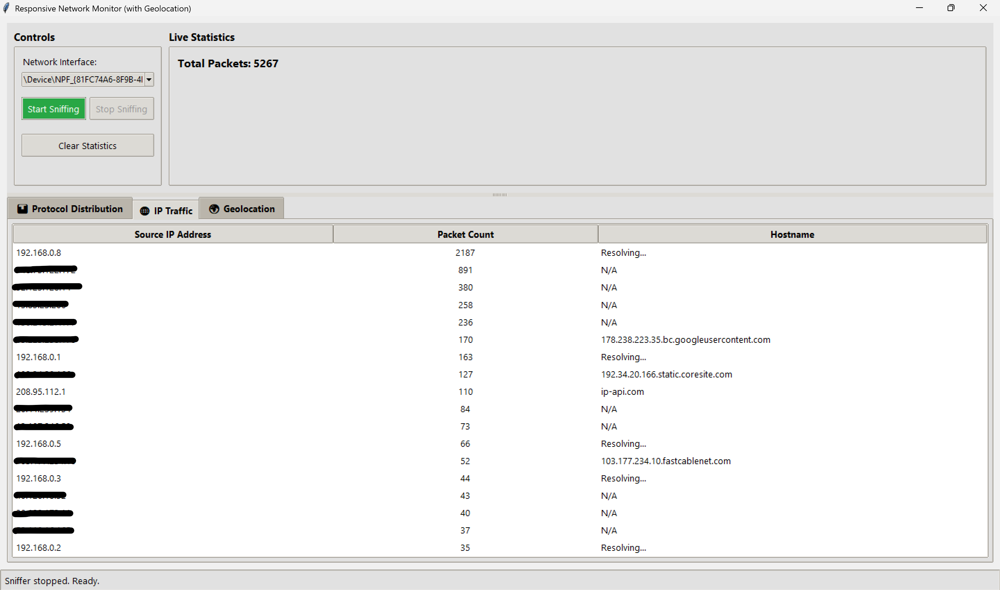
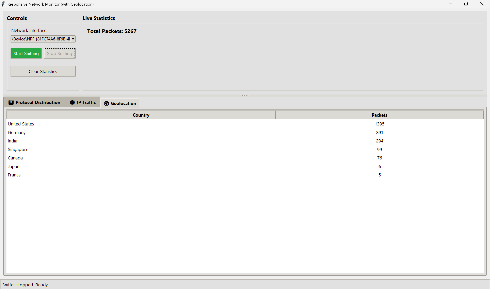

# Interactive Network Monitor with Geolocation

A desktop application built with Python and Tkinter for live network traffic monitoring. This tool provides a user-friendly interface to capture and analyze network packets in real-time, helping users understand the activity on their network, including the physical location of remote servers.

---

## Features Showcase

This tool provides multiple views to analyze network traffic from different perspectives.

**1. Protocol Distribution:** See a real-time breakdown of traffic by protocol (TCP, UDP, ICMP).


**2. IP Traffic & Hostname Resolution:** View the top IP addresses sending traffic and their resolved hostnames.


**3. Live Geolocation:** Discover the countries your computer is communicating with, updated live.


---

## Key Features

- **Live Packet Sniffing:** Captures network packets in real-time using the powerful Scapy library.
- **Interactive Controls:** Easy-to-use Start and Stop buttons to control the capture session.
- **Smart Interface Selection:** Automatically filters the network interface list to show only active, usable adapters.
- **Multi-Tabbed Data Views:** Analyze data by Protocol, IP Address, and Geolocation.
- **Hostname & Geolocation Resolution:** Enriches raw IP addresses with human-readable hostnames and country data for easier identification.
- **Responsive UI:** A multi-threaded architecture ensures the user interface never freezes, even while performing slow network lookups.

---

## Requirements

- Python 3.7+
- `pip` (The Python package installer)

---

## Setup and Installation

Follow these steps to get the application running on your local machine.

**1. Get the Code**
Download all the project files (`app.py`, `requirements.txt`, etc.) into a single folder on your computer.

**2. Install Dependencies**
Open a terminal or command prompt and navigate to your project folder. Then, install the required libraries using `pip`.
```bash
pip install -r requirements.txt
```

---

## How to Run

**⚠️ Important: Administrator Privileges Required!**

To capture network packets, this application **must** be run with administrator or root privileges.

**On Windows:**
1. Open **Command Prompt** or **PowerShell** as an **Administrator**.
2. Navigate to the project directory where you saved `gui_app.py`.
3. Run the application:
```bash
python gui_app.py
```

**On macOS / Linux:**
1. Open a terminal.
2. Navigate to the project directory where you saved `gui_app.py`.
3. Run the application using `sudo`:
```bash
sudo python3 gui_app.py
```
